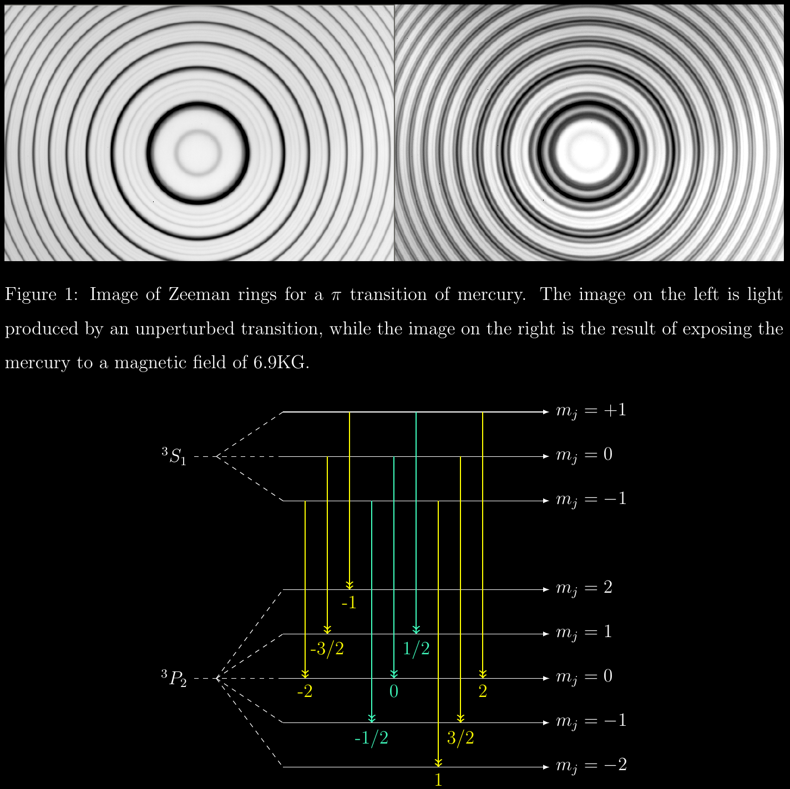

# Zeeman
Exposing mercury vapor to magnetic fields. 

By applying a magnetic field and an electric current to mercury vapor, we were able to measure the splitting of energy levelz of the mercury atom. 

The complete document can be viewed under Zeeman_Ramirez.pdf

